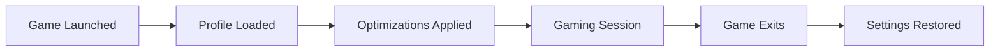

<h1 align="center">GameShift</h1>

<p align="center">
  <a href="https://github.com/lhceist41/GameShift/releases/latest"></a>
  
  
  
  <a href="LICENSE"></a>
  <a href="https://github.com/lhceist41/GameShift/stargazers"></a>
</p>

<p align="center">
  <b>One-click, reversible Windows optimization for every game in your library.</b><br/>
  GameShift auto-detects your installed games, applies system-level tweaks per title,<br/>
  and restores everything the moment you stop playing.
</p>

---

<details>
<summary><strong>Table of Contents</strong></summary>

- [Features](#-features)
- [How It Works](#%EF%B8%8F-how-it-works)
- [Quick Start](#-quick-start)
- [System Requirements](#-system-requirements)
- [Safety & Transparency](#%EF%B8%8F-safety--transparency)
- [Anti-Cheat Compatibility](#-anti-cheat-compatibility)
- [FAQ](#-faq)
- [Roadmap](#%EF%B8%8F-roadmap)
- [Contributing](#-contributing)
- [License](#-license)

</details>

---

## ✨ Features

> [!NOTE]
> Every optimization is fully reversible. GameShift snapshots your settings before applying changes and auto-reverts when your game exits.

| Optimization | What it does | Reversible |
|:-------------|:-------------|:----------:|
| **Service Suppression** | Pauses 18 non-essential Windows services (telemetry, indexing, Xbox services, etc.) during gameplay | ✅ |
| **Power Plan** | Switches to Ultimate Performance scheme — creates the plan if it's missing | ✅ |
| **Timer Resolution** | Sets system timer to 0.5 ms for lower input latency and tighter frame pacing | ✅ |
| **Process Priority** | Elevates the game process to High priority for better CPU scheduling | ✅ |
| **Memory Optimization** | Monitors available RAM every 5 s and purges the standby list when it drops below threshold | ✅ |
| **Visual Effects** | Disables Windows transparency and animations via registry and SystemParametersInfo | ✅ |
| **Network Tuning** | Disables Nagle's algorithm (`TcpAckFrequency`, `TCPNoDelay`) on all interfaces and stops Delivery Optimization | ✅ |
| **Hybrid CPU Pinning** | Detects P-cores vs E-cores on Intel 12th–14th gen CPUs and pins your game to performance cores only | ✅ |
| **MPO Disable** | Disables Multiplane Overlay — fixes micro-stutter on multi-monitor setups with mismatched refresh rates | ✅ |
| **Competitive Mode** | Suspends overlay processes (Discord, Steam, NVIDIA), kills GPU-hungry background apps (Widgets, Edge WebView), respects anti-cheat blocklists | ✅ |
| **GPU Driver Optimization** | Auto-detects NVIDIA or AMD and applies vendor-specific registry tweaks (low latency, shader cache, power mode) | ✅ |

### 🎯 Auto Game Detection

GameShift scans your Steam, Epic Games, and GOG install directories on first launch and keeps the library in sync automatically. Each detected game gets a per-game JSON profile stored in `%AppData%/GameShift/profiles/` that controls exactly which optimizations apply.

```json
{
  "GameName": "Counter-Strike 2",
  "ExecutableName": "cs2.exe",
  "SuppressServices": true,
  "SwitchPowerPlan": true,
  "SetTimerResolution": true,
  "BoostProcessPriority": true,
  "OptimizeMemory": true,
  "ReduceVisualEffects": true,
  "OptimizeNetwork": true,
  "UsePerformanceCoresOnly": false,
  "DisableMpo": false,
  "EnableCompetitiveMode": false,
  "EnableGpuOptimization": true
}
```

GameShift also ships with **19 built-in game profiles** that include hardware-specific tuning, anti-cheat compatibility notes, and per-game tips for titles like Overwatch 2, Valorant, CS2, Fortnite, Minecraft, FFXIV, and more.

### 📊 Monitoring & Diagnostics

| Feature | Description |
|:--------|:------------|
| **Real-time Monitoring** | Live CPU, GPU, RAM, VRAM, and network telemetry with per-session history |
| **DPC Latency Doctor** | ETW-based per-driver DPC/ISR attribution with automated fixes and rollback |
| **Session History** | Post-session reports with duration, optimization count, and DPC statistics |

---

## ⚙️ How It Works



GameShift uses WMI process creation events to detect game launches in real time. When a game starts, the detection orchestrator matches it against your library, loads the appropriate profile, and applies each enabled optimization in sequence. Before making any change, a `SystemStateSnapshot` captures the original value so every modification is cleanly reverted when the game closes.

---

## 🚀 Quick Start

### Download (recommended)

1. Grab the latest `GameShift.App.exe` from the [Releases page](https://github.com/lhceist41/GameShift/releases/latest)
2. Run as **Administrator** — required for timer resolution, service control, and power plan switching
3. Complete the first-run wizard — GameShift auto-detects your installed games and runs a hardware scan

### Build from Source

**Prerequisites:** .NET 9 SDK, Visual Studio 2022 17.12+, Windows 10 21H2+ (x64)

```bash
git clone https://github.com/lhceist41/GameShift.git
cd GameShift
dotnet restore
dotnet build --configuration Release
dotnet run --project src/GameShift.App
```

---

## 💻 System Requirements

| Requirement | Details |
|:------------|:--------|
| **OS** | Windows 10 version 2004+ / Windows 11 |
| **Architecture** | x64 |
| **RAM** | 4 GB minimum |
| **Runtime** | .NET 9 — bundled with release builds |
| **Privileges** | Administrator — required to modify services, registry keys, timer resolution, and power plans |

---

## 🛡️ Safety & Transparency

> [!CAUTION]
> Create a System Restore point before your first use. GameShift modifies system-level settings that are all reversible, but a restore point provides an extra safety net.

### What GameShift changes (and how to undo it)

- **Services** — Temporarily sets non-essential services to Manual start type. Original start types are recorded and restored when the game exits.
- **Power plan** — Creates or switches to the Ultimate Performance power scheme. Your original power plan GUID is saved and re-applied on revert.
- **Registry keys** — Writes timer resolution and optimization flags to `HKLM`. All original values are backed up to `%AppData%/GameShift/backups/` before any write.
- **Process priority** — Elevates the game process to High and optionally pins CPU affinity. Changes apply only while the game is running and are released on exit.

### Why administrator privileges are required

Windows protects service configuration and `HKLM` registry access behind administrator-level permissions. GameShift makes **no network calls**, collects **no telemetry**, and stores **all data locally** on your machine.

### Transparency guarantees

- Source code is fully open and auditable — see [`src/`](src/)
- All optimization logic lives in [`src/GameShift.Core/Optimization/`](src/GameShift.Core/Optimization/)

---

## 🔒 Anti-Cheat Compatibility

GameShift uses registry-based workarounds (IFEO `PerfOptions`) and parent-process inheritance for process priority and CPU affinity. It does **not** inject into game processes, does **not** modify game files, and does **not** hook into game memory. System-level tools like ISLC, timer resolution, and power plan switching are universally safe across all anti-cheat systems.

> [!IMPORTANT]
> GameShift has been tested with EAC (Easy Anti-Cheat), BattlEye, Vanguard, and RICOCHET without issues. Kernel-level anti-cheat may block direct process manipulation on the game executable — GameShift automatically falls back to registry-based methods. Always verify with your specific game's Terms of Service.

---

## ❓ FAQ

<details>
<summary><strong>Will this get me banned?</strong></summary>
<br/>
No. GameShift modifies Windows system settings — not game files, game memory, or game processes. Anti-cheat systems target memory injection, aimbots, and wallhacks. Changing your power plan or clearing the standby list is not detectable and not against any game's Terms of Service. Thousands of players use the same underlying tools (ISLC, Process Lasso, timer resolution utilities) without issue.
</details>

<details>
<summary><strong>Does it work with Game Pass / Xbox games?</strong></summary>
<br/>
Game Pass titles aren't auto-detected yet (only Steam, Epic, and GOG libraries are scanned), but you can add any game manually through the <strong>Add Game</strong> button. System-level optimizations (power plan, timer resolution, memory cleaning, network tuning) work identically on Game Pass titles. Process priority elevation may be limited on some UWP-packaged titles due to Windows sandboxing.
</details>

<details>
<summary><strong>Can I use it on a laptop?</strong></summary>
<br/>
Absolutely. GameShift is particularly useful on laptops where Windows aggressively throttles performance to save battery. The power plan switch and power throttling disable can unlock significant FPS gains. Just make sure you're plugged in — running at full performance on battery will drain it quickly.
</details>

<details>
<summary><strong>What happens if my PC crashes during optimization?</strong></summary>
<br/>
All original values are saved to <code>%AppData%/GameShift/backups/</code> before any change is made. On next launch, GameShift detects the incomplete session and offers to restore your previous settings. Services revert to their default start type on reboot regardless, and power plan changes persist only if explicitly saved. In the worst case, a System Restore point will undo everything.
</details>

<details>
<summary><strong>How do I create a custom profile for a game?</strong></summary>
<br/>
Open GameShift, navigate to the Games tab, and click <strong>Add Game</strong>. Browse to the game executable, name the profile, and toggle which optimizations you want applied. The profile is saved as a JSON file in <code>%AppData%/GameShift/profiles/</code> and activates automatically whenever that executable launches.
</details>

<details>
<summary><strong>Why does Windows Defender flag GameShift?</strong></summary>
<br/>
GameShift modifies Windows services, writes to protected registry keys, and changes system timer resolution — behaviors that heuristic scanners sometimes flag as suspicious. The application is open source and you can audit every line. If Defender quarantines the executable, add an exclusion for <code>GameShift.App.exe</code> or build from source yourself.
</details>

---

## 🗺️ Roadmap

- [x] v2.0 — Per-game JSON profiles, auto game detection
- [x] v2.1 — Real-time monitoring, DPC troubleshooting, session history
- [x] v2.5 — System tweaks panel, background mode, competitive presets
- [x] v2.6 — 19 built-in game profiles with anti-cheat compatibility
- [ ] v2.7 — GPU optimization, frame limiter integration
- [ ] v2.8 — Community profile sharing
- [ ] v3.0 — Plugin system for community optimizations

---

## 🤝 Contributing

Contributions are welcome! See [CONTRIBUTING.md](CONTRIBUTING.md) for detailed guidelines.

```bash
# 1. Fork the repository

# 2. Create a feature branch
git checkout -b feature/your-feature

# 3. Make your changes and run tests
dotnet test

# 4. Commit
git commit -m "feat: add your feature"

# 5. Push and open a PR
git push origin feature/your-feature
```

Issues and feature requests are always welcome — open one on the [Issues page](https://github.com/lhceist41/GameShift/issues).

---

## 📄 License

This project is licensed under the [MIT License](LICENSE).

---

<p align="center">
  If GameShift improved your gaming experience, consider leaving a ⭐ — it helps others find the project.
</p>
