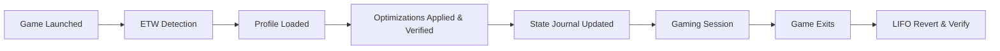

<h1 align="center">GameShift</h1>

<p align="center">
  <a href="https://github.com/lhceist41/GameShift/releases/latest"></a>
  
  
  
  <a href="LICENSE"></a>
  <a href="https://github.com/lhceist41/GameShift/stargazers"></a>
</p>

<p align="center">
  <b>Intelligent, reversible Windows optimization for every game in your library.</b><br/>
  GameShift detects your games instantly, applies verified system-level optimizations per title,<br/>
  and restores everything the moment you stop playing  - with crash recovery that never leaves your system in a broken state.
</p>

---

<details>
<summary><strong>Table of Contents</strong></summary>

- [Features](#-features)
- [How It Works](#%EF%B8%8F-how-it-works)
- [Quick Start](#-quick-start)
- [System Requirements](#-system-requirements)
- [Safety & Transparency](#%EF%B8%8F-safety--transparency)
- [Anti-Cheat Compatibility](#-anti-cheat-compatibility)
- [FAQ](#-faq)
- [Contributing](#-contributing)
- [License](#-license)

</details>

---

## ✨ Features

> [!NOTE]
> Every optimization is fully reversible. GameShift records original values in a state journal before applying changes, verifies each change took effect, and auto-reverts in LIFO order when your game exits. A watchdog service and boot recovery task ensure your system is restored even after a crash or blue screen.

### Quick Start

| Feature | Description |
|:--------|:------------|
| **One-Click Optimize** | Large "Optimize Now" button on the Dashboard applies all recommended system optimizations instantly. Shows a preview of what will be applied before clicking. Reverts with one click when done. |
| **Easy Mode** | Toggle in the Dashboard top-right to simplify the UI. Hides advanced pages and settings, leaving only the Dashboard and Settings visible. Defaults to Advanced Mode (all pages) for new installs. |

### Session Optimizations

These activate when a game launches and revert when the game closes.

| Optimization | What it does |
|:-------------|:-------------|
| **Process Priority Booster** | Elevates the game to High priority with optimal `Win32PrioritySeparation` (0x2A). Detects anti-cheat systems and automatically falls back to IFEO registry when runtime API calls are blocked. |
| **Service Suppression** | Pauses 20+ non-essential Windows services across three configurable tiers  - telemetry, indexing, Windows Update, Delivery Optimization, and more. Safety list protects critical services. |
| **Scheduled Task Suppression** | Disables resource-heavy tasks (defrag, telemetry, update scans) across three tiers during gameplay. Optional Defender scan suppression. |
| **Intelligent Memory Management** | Threshold-based standby list purging  - only clears memory when both the standby list is large AND free memory is critically low, auto-scaled to your total RAM. Targeted `EmptyWorkingSet` on background processes protects game assets while freeing RAM. Hard minimum working set on the game process prevents Windows from trimming game pages. |
| **Timer Resolution** | Sets system timer to 0.5ms (Competitive) or 1.0ms (Casual). Includes Windows 11 `GlobalTimerResolutionRequests` fix so the resolution applies system-wide, not just to GameShift. Runs on a dedicated windowless thread immune to minimize/occlusion resets. |
| **Power Plan Switching** | Activates Ultimate Performance scheme during gaming. Creates the plan if missing. |
| **CPU Core Unparking** | Unparks all cores, disables processor idle in Competitive mode (forces C0 state). Vendor-aware parking values for AMD X3D dual-CCD. |
| **Hybrid CPU Scheduling** | Detects P-cores vs E-cores on Intel 12th–15th gen and AMD hybrid CPUs via CPU Sets API. Assigns the game to P-cores and background processes to E-cores using soft affinity that cooperates with Intel Thread Director. Disables power throttling on the game (HighQoS) and enables EcoQoS on background processes. Falls back gracefully on non-hybrid CPUs. |
| **Core Isolation** | Advanced opt-in feature: reserves specific P-cores exclusively for gaming via `ReservedCpuSets`. No other process can schedule onto reserved cores  - OS-enforced. Visual core map in the UI for selecting which cores to reserve. Requires reboot. |
| **MPO Disable** | Disables Multiplane Overlay to fix micro-stutter on multi-monitor setups. Includes Windows 11 24H2/25H2 fix using `DisableOverlays`  - the legacy `OverlayTestMode` key is no longer honored on recent builds. Competitive mode only. |
| **Visual Effect Reducer** | Disables transparency and animations during gameplay. |
| **Efficiency Mode Control** | Applies Windows 11 EcoQoS to background processes, constraining them to E-cores. Rescans every 30 seconds to catch newly spawned processes. |
| **I/O Priority Manager** | Lowers I/O priority of background processes to reduce disk contention. PID reuse safety prevents accidental priority changes. |
| **Network Optimizer** | Disables Nagle's algorithm, stops Delivery Optimization, disables multimedia network throttling (`NetworkThrottlingIndex`), tunes NIC settings (interrupt moderation, LSO, RSC). |
| **GPU Driver Optimizer** | Auto-detects NVIDIA, AMD, or Intel GPU. NVIDIA: programs driver profiles directly via NvAPI DRS  - max pre-rendered frames, unlimited shader cache, Ultra low latency mode, max performance power. AMD: disables ULPS and deep sleep, sets flip queue to 1 frame, attempts ADLX Anti-Lag. All vendors: extends TDR timeout to prevent false GPU resets during shader compilation. NVIDIA-specific: forces P-State 0 and CUDA spin mode for lowest latency. |
| **ProBalance** | Monitors background process CPU usage in real time during gaming. Automatically demotes processes that spike above 15% CPU for sustained periods to BelowNormal priority. Restores them when they calm down. Safety list protects games, anti-cheat, audio, and system processes. |
| **Competitive Mode** | Suspends overlay processes (Discord, Steam, NVIDIA), kills GPU-hungry background apps (Widgets, Edge WebView). Respects anti-cheat blocklists. |
| **System Tweaks** | Configures the Multimedia SystemProfile for gaming priority (`GPU Priority=8`, `Scheduling Category=High`, `SFIO Priority=High`). Disables USB selective suspend for HID peripherals, disables PCIe ASPM link state power management. Applied during sessions, reverted on exit. |

### Background Mode (Always-On)

These run 24/7 when Background Mode is enabled, independent of gaming sessions.

| Service | What it does |
|:--------|:-------------|
| **Standby List Cleaner** | Threshold-based polling  - only purges when both the standby list exceeds a configured size AND free memory drops below a minimum. Auto-scaled defaults by total RAM. |
| **Timer Resolution Lock** | Maintains high timer resolution at all times (0.5ms default). Includes Windows 11 `GlobalTimerResolutionRequests` registry fix. |
| **Custom Power Plan** | Creates a "GameShift Performance" plan cloned from Ultimate Performance with 50+ aggressive overrides covering processor tuning, storage, USB, wireless, idle resiliency, interrupt steering, display, sleep, multimedia, and vendor-aware heterogeneous scheduling (Intel hybrid P/E core bias, AMD single/dual-CCD). Three-state management: Gaming (idle disabled), Desktop (custom plan active), and Idle (auto-switches to Balanced after configurable timeout). |
| **Task Deferral** | Defers resource-heavy Windows scheduled tasks during active gaming sessions. |
| **Process Priority Persistence** | Applies persistent priority rules to background processes (e.g., Chrome → BelowNormal). Respects active gaming sessions. |

### Monitoring & Diagnostics

| Feature | Description |
|:--------|:------------|
| **Real-time Performance** | Live CPU, GPU, RAM, VRAM, and network ping telemetry with sparkline graphs. Pauses during gaming to eliminate polling overhead. |
| **Temperature Monitoring** | CPU and GPU temperature tracking via LibreHardwareMonitor. |
| **DPC Latency Doctor** | ETW-based per-driver DPC/ISR attribution, known problematic driver database, one-click quick fixes (registry, BCDEdit, netsh, power plan, network adapter) with rollback. Interrupt affinity display showing current GPU and USB interrupt core assignments, MSI mode status. Kernel tuning panel with per-setting apply/revert for `disabledynamictick`, `useplatformtick`, `tscsyncpolicy`, `x2apicpolicy`, `hypervisorlaunchtype`, and `useplatformclock`. Core isolation visual map for reserving P-cores. |
| **DPC Latency Monitor** | Passive latency sampling during gaming with configurable spike thresholds and toast notifications. |
| **GPU Advisories** | Detects HAGS (Hardware Accelerated GPU Scheduling) and Resizable BAR/SAM status. Shows recommendations if performance features are available but not enabled. |
| **Session History** | Post-session summary toast with duration, applied/failed optimization counts, and DPC statistics. Per-game tracking and statistics. |
| **Driver Version Tracker** | Detects installed GPU and audio drivers, checks against known advisory database, flags problematic versions. |
| **Benchmarking** | PresentMon-based frame time capture for performance measurement. |

### Persistent System Tweaks

One-time optimizations that persist across reboots. Applied once, revertible at any time.

| Tweak | What it does |
|:------|:-------------|
| **Game DVR Disable** | Disables Game Bar capture hooks and Game DVR recording. Keeps Game Mode enabled (it complements GameShift). |
| **VBS/HVCI Disable** | Disables Virtualization-Based Security and Memory Integrity for 5–15% FPS uplift. Safety interlock blocks disable when Riot Vanguard is detected. |
| **NTFS Optimization** | Disables last access time updates, 8.3 name creation, and increases NTFS memory cache usage. |
| **Kernel Memory** | `DisablePagingExecutive` keeps kernel pages in physical RAM. `LargeSystemCache=0` optimizes for applications. |
| **Full-Screen Optimizations** | Per-game disable via GameConfigStore registry. |

### Interrupt & Kernel Tuning

Available through the DPC Doctor page with per-setting control and full rollback.

| Feature | What it does |
|:--------|:-------------|
| **GPU Interrupt Affinity** | Pins GPU interrupts to a specific P-core (not core 0) for consistent DPC latency. |
| **USB Controller Affinity** | Pins USB host controller interrupts to reduce input latency. |
| **MSI Mode** | Enables Message Signaled Interrupts for GPU and USB controllers where supported. |
| **BCDEdit Kernel Tuning** | Configures `disabledynamictick`, `useplatformtick`, `tscsyncpolicy enhanced`, `x2apicpolicy enable` for improved timer accuracy and interrupt routing. Competitive tier includes hypervisor disable (with Hyper-V/WSL2/Docker dependency check). |

> [!WARNING]
> Interrupt affinity and BCDEdit changes require a reboot. GameShift tracks pending reboot fixes in the state journal and prompts you when a restart is needed.

### Game Library & Profiles

- **Auto-detection** from Steam, Epic Games, GOG Galaxy, and Xbox/Game Pass install directories, plus a built-in database of 80+ popular game executables as fallback
- **19 built-in game profiles** with hardware-specific tuning and anti-cheat metadata for titles including Overwatch 2, Valorant, CS2, Fortnite, Apex Legends, Deadlock, osu!, Elden Ring, Arknights: Endfield, Wuthering Waves, and more
- **Per-game toggle control** for every optimization with sub-toggles for advanced options
- **Optimization Intensity** per profile  - Competitive (0.5ms timer, processor idle disabled, MPO off) or Casual (1.0ms timer, gentler settings for single-player titles)
- **Game-specific tips** shown as toast notifications on first launch (38 built-in tips covering performance settings, anti-cheat quirks, and common pitfalls)
- **Manual game adding** for any executable not in a scanned library

---

## ⚙️ How It Works



GameShift uses ETW (Event Tracing for Windows) kernel process events to detect game launches with sub-millisecond latency. When a game starts, the detection orchestrator matches it against your library, loads the appropriate profile, and applies each enabled optimization in sequence. Every change is recorded in a state journal with original and applied values so every modification can be deterministically reverted  - even after a crash, blue screen, or power loss.

A background watchdog service monitors GameShift's health via heartbeat. If the app crashes, the watchdog reads the state journal and reverts all changes within 15 seconds. A boot recovery task handles blue screens and power loss by checking the journal on startup.

Registry changes are monitored in real time via `RegNotifyChangeKeyValue`. If an external process (Windows Update, group policy, another tool) modifies a managed setting during a gaming session, GameShift detects and re-applies it automatically.

For games with kernel-level anti-cheat (EAC, BattlEye, RICOCHET, TencentACE), GameShift automatically falls back to IFEO (Image File Execution Options) registry-based settings instead of runtime API calls that the anti-cheat would block.

---

## 🚀 Quick Start

### Download (recommended)

1. Grab the latest `GameShift.App.exe` from the [Releases page](https://github.com/lhceist41/GameShift/releases/latest)
2. Run as **Administrator** (required for service control, registry access, timer resolution, and power plan management)
3. Complete the first-run wizard  - GameShift auto-detects your installed games, scans your hardware, and installs the watchdog service

### Build from Source

**Prerequisites:** .NET 9 SDK, Visual Studio 2022 17.12+, Windows 10 21H2+ (x64)

```bash
git clone https://github.com/lhceist41/GameShift.git
cd GameShift
dotnet restore
dotnet build --configuration Release
dotnet run --project src/GameShift.App
```

---

## 💻 System Requirements

| Requirement | Details |
|:------------|:--------|
| **OS** | Windows 10 21H2+ / Windows 11 22H2+ |
| **Architecture** | x64 |
| **RAM** | 8 GB minimum, 16 GB+ recommended |
| **Runtime** | .NET 9 (bundled with release builds) |
| **Privileges** | Administrator |

> [!NOTE]
> Some features require specific Windows versions. CPU Sets scheduling requires Windows 11 22H2+. Timer resolution system-wide fix and `GlobalTimerResolutionRequests` require Windows 11. All features degrade gracefully on older builds.

---

## 🛡️ Safety & Transparency

> [!CAUTION]
> Create a System Restore point before your first use. GameShift modifies system-level settings that are all reversible, but a restore point provides an extra safety net.

### Three-layer crash recovery

1. **State Journal**  - Every optimization writes its original and applied values to `%ProgramData%\GameShift\state.json` using atomic writes (temp file → rename). Reverts happen in LIFO order with post-revert verification.
2. **Watchdog Service**  - A lightweight Windows Service (`GameShift.Watchdog`) monitors the main app via named pipe heartbeat. If GameShift crashes, the watchdog detects it within 15 seconds and reverts all active optimizations from the journal.
3. **Boot Recovery**  - A scheduled task runs at startup. If the journal shows an active session (meaning a BSOD or power loss occurred), it reverts all optimizations. Also detects Windows Update build changes and flags settings for re-verification.

### What GameShift changes (and how it reverts)

- **Services**  - Temporarily pauses non-essential services. Original start types recorded in journal, restored on session end.
- **Registry keys**  - Writes timer resolution, GPU driver settings, network tuning, power settings, and IFEO entries. All original values captured before any write and verified after revert.
- **Power plans**  - Creates or switches to Ultimate Performance (or the custom "GameShift Performance" plan). Your original plan GUID is saved and restored.
- **Process priority & scheduling**  - Elevates game priority, assigns CPU sets, manages memory priority and working sets. All released on game exit.
- **BCD settings**  - Optional kernel tuning (timer, APIC, TSC) via BCDEdit with one-click revert. Tracked in pending reboot fixes.
- **Interrupt affinity**  - Optional GPU and USB interrupt routing changes with rollback to default Windows assignment.

### Why administrator privileges are required

Windows protects service configuration, `HKLM` registry access, timer resolution, ETW sessions, and power plan management behind administrator permissions. GameShift makes **no network calls** except to check for updates on GitHub, collects **no telemetry**, and stores **all data locally**.

### Transparency

- Source code is fully open and auditable (see [`src/`](src/))
- All optimization logic lives in [`src/GameShift.Core/Optimization/`](src/GameShift.Core/Optimization/)

---

## 🔒 Anti-Cheat Compatibility

GameShift includes built-in anti-cheat detection and automatic compatibility adjustments:

| Anti-Cheat | Status | Approach |
|:-----------|:-------|:---------|
| **Riot Vanguard** (Valorant, LoL) | ✅ Fully compatible | VBS/HVCI safety interlock prevents conflicts. GameShift blocks VBS disable when Vanguard is detected. |
| **Easy Anti-Cheat** (Fortnite, Apex, Rust, Elden Ring) | ✅ Fully compatible | IFEO registry fallback for priority. |
| **BattlEye** (Arknights: Endfield, PUBG) | ✅ Fully compatible | IFEO registry fallback. |
| **RICOCHET** (Call of Duty) | ✅ Fully compatible | IFEO registry fallback. |
| **TencentACE** (Wuthering Waves) | ✅ Fully compatible | IFEO registry fallback. |
| **Valve Anti-Cheat** (CS2, Deadlock) | ✅ Fully compatible | User-mode only; no restrictions on system-level tools. |
| **FACEIT AC** | ✅ Fully compatible | VBS/HVCI safety gating. |

GameShift does **not** inject into game processes, does **not** modify game files, and does **not** hook into game memory. All optimizations operate at the Windows system level using standard Win32 APIs and registry settings.

> [!IMPORTANT]
> Anti-cheat detection is automatic via service queries, driver files, and registry keys. When kernel-level anti-cheat blocks runtime process manipulation, GameShift switches to IFEO PerfOptions. Always verify with your specific game's Terms of Service.

---

## ❓ FAQ

<details>
<summary><strong>Will this get me banned?</strong></summary>
<br/>
No. GameShift modifies Windows system settings  - power plans, timer resolution, service configuration, memory management. It does not touch game files, game memory, or game processes in ways that anti-cheat systems flag. The same underlying techniques (standby list management, timer resolution, interrupt affinity) are used by thousands of competitive players through standalone tools like ISLC, Process Lasso, and Timer Resolution.
</details>

<details>
<summary><strong>Does it work with Game Pass / Xbox games?</strong></summary>
<br/>
Yes. GameShift scans Xbox/Game Pass install directories alongside Steam, Epic, and GOG. System-level optimizations work identically on all titles. Process priority elevation may be limited on some UWP-packaged titles due to Windows sandboxing.
</details>

<details>
<summary><strong>Can I use it on a laptop?</strong></summary>
<br/>
Yes. GameShift is particularly effective on laptops where Windows aggressively throttles performance to save battery. The Background Mode idle timeout automatically switches to Balanced when you step away, preserving battery when you're not gaming.
</details>

<details>
<summary><strong>What happens if my PC crashes during optimization?</strong></summary>
<br/>
GameShift has three-layer crash recovery. A watchdog service detects app crashes within 15 seconds and reverts all changes. A boot recovery task handles blue screens and power loss by checking the state journal on startup. All original values are stored in <code>%ProgramData%\GameShift\state.json</code> using atomic writes, ensuring the journal is never corrupted even during a hard shutdown.
</details>

<details>
<summary><strong>What is the "GameShift Performance" power plan?</strong></summary>
<br/>
When Background Mode is enabled, GameShift creates a custom power plan cloned from Ultimate Performance with 50+ overrides covering processor boost, core parking, USB suspend, PCI Express power management, idle resiliency, interrupt steering, display/sleep settings, multimedia optimization, and vendor-aware scheduling for Intel hybrid and AMD X3D processors. It manages three states: Gaming (max performance), Desktop (custom plan, idle monitoring), and Idle (switches to Balanced after a configurable timeout to save power).
</details>

<details>
<summary><strong>What is the difference between Competitive and Casual?</strong></summary>
<br/>
Competitive enables aggressive optimizations: processor idle disable (forces C0 state), 0.5ms timer resolution, MPO disable, all BCDEdit kernel tunings. Casual uses gentler settings (1.0ms timer, no idle disable, no MPO change) suitable for single-player and story-driven games. Built-in profiles assign the appropriate tier automatically  - Valorant and osu! default to Competitive, single-player titles default to Casual. You can change the intensity per game in the profile editor.
</details>

<details>
<summary><strong>Do I need an Intel hybrid CPU to benefit?</strong></summary>
<br/>
No. CPU Sets scheduling and Core Isolation are hybrid-only features, but everything else  - memory management, timer resolution, GPU optimization, service suppression, ProBalance, interrupt affinity, kernel tuning  - works on any modern CPU from Intel or AMD.
</details>

<details>
<summary><strong>Why does Windows Defender flag GameShift?</strong></summary>
<br/>
GameShift modifies Windows services, writes to protected registry keys, manages ETW sessions, and changes system timer resolution. These behaviors are sometimes flagged by heuristic scanners. The application is open source and fully auditable. If Defender quarantines the executable, add an exclusion for <code>GameShift.App.exe</code> and <code>GameShift.Watchdog.exe</code>, or build from source.
</details>

---

## 🤝 Contributing

Contributions are welcome! See [CONTRIBUTING.md](CONTRIBUTING.md) for guidelines.

```bash
git clone https://github.com/lhceist41/GameShift.git
cd GameShift
git checkout -b feature/your-feature
dotnet test
git commit -m "feat: your feature"
git push origin feature/your-feature
```

Issues and feature requests are welcome on the [Issues page](https://github.com/lhceist41/GameShift/issues).

---

## 📄 License

This project is licensed under the [MIT License](LICENSE).

---

<p align="center">
  If GameShift improved your gaming experience, consider leaving a ⭐ on the repo.
</p>
